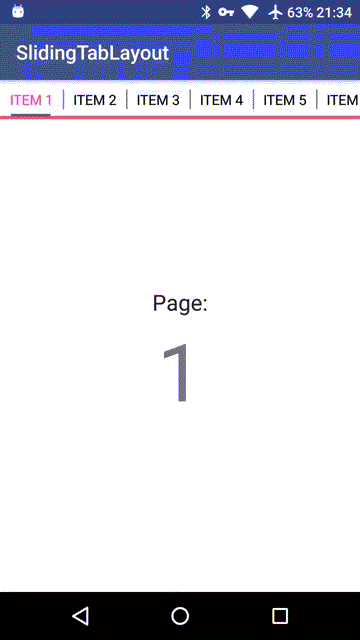
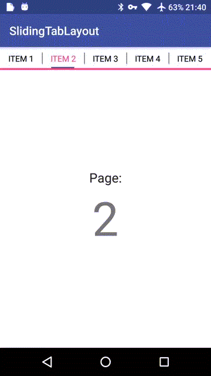

# SlidingTabLayout


### 简介
修改自Google的SlidingTabLayout项目，改变了Tab指示器的长度与文字等长。

### 效果
slidingTabLayout.setViewPager(viewPager);




slidingTabLayout.setViewPager(viewPager,true);



### 使用方法
添加依赖到项目的*build.gradle* 下

```
    compile 'com.achenging.view:slidingtablayout:1.0.0'
```

xml下添加

```
   <com.achenging.view.SlidingTabLayout
        android:id="@+id/sliding_tabs"
        android:layout_width="match_parent"
        android:layout_height="wrap_content"
        app:showAsDivider="true"
        app:dividerColor="@color/colorPrimary"
        app:dividerThickness="1dp"
        app:tabSelectedTextColor="@color/colorAccent"
        app:tabTextColor="@android:color/black"
        app:tabIndicatorThickness="2dp"
        app:tabIndicatorColor="@color/colorPrimary"
        app:bottomBorderThickness="1dp"
        app:bottomBorderColor="@color/colorAccent"
        />

    <android.support.v4.view.ViewPager
        android:id="@+id/viewpager"
        android:layout_width="match_parent"
        android:layout_height="match_parent"
        android:background="@android:color/white"/>
```

* app:showAsDivider="true"                       //是否显示tab之间的分割线，默认不显示
* app:dividerColor="@color/colorPrimary"         //tab分割线的颜色
* app:dividerThickness="1dp"                     //tab分割线的粗细
* app:tabSelectedTextColor="@color/colorAccent"  //tab选中的字体颜色
* app:tabTextColor="@android:color/black"        //tab默认的字体颜色
* app:tabIndicatorThickness="2dp"                //tab指示器的粗细
* app:tabIndicatorColor="@color/colorPrimary"    //tab指示器的颜色
* app:bottomBorderThickness="1dp"                //tab底部整条滚动条的颜色
* app:bottomBorderColor="@color/colorAccent"     //tab底部整条滚动条的颜色

Java中的使用

```
        ViewPager viewPager = (ViewPager) findViewById(R.id.viewpager);
        viewPager.setAdapter(new SamplePagerAdapter());
        SlidingTabLayout slidingTabLayout = (SlidingTabLayout) findViewById(R.id.sliding_tabs);
        slidingTabLayout.setViewPager(viewPager);

        //slidingTabLayout.setViewPager(viewPager, true); //关闭滚动，平均分割每个tab，具体看效果图
```


License
============

    Copyright 2017 achenging

    Licensed under the Apache License, Version 2.0 (the "License");
    you may not use this file except in compliance with the License.
    You may obtain a copy of the License at

     http://www.apache.org/licenses/LICENSE-2.0

    Unless required by applicable law or agreed to in writing, software
    distributed under the License is distributed on an "AS IS" BASIS,
    WITHOUT WARRANTIES OR CONDITIONS OF ANY KIND, either express or implied.
    See the License for the specific language governing permissions and
    limitations under the License.